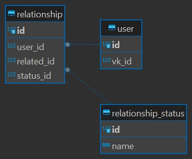

# VK_BOT_NETOLOGY – ваш надежный спутник в мире знакомств!

## Цель проекта

Цель проекта — разработка бота для знакомств в социальной сети ВКонтакте, который взаимодействует с базой данных и предлагает различные варианты людей для знакомств, основываясь на информации о пользователе.

## Чек-лист готовности к работе над проектом

1. Изучена «Инструкция по выполнению командного проекта» и «Правила работы в команде».
2. Знаем, кто в команде и как будем общаться.
3. Создан общий репозиторий на GitHub.
4. Установлены Python 3.x и IDE.
5. Настроен компьютер для работы с PostgreSQL.
6. Установлен git и создан аккаунт на GitHub.
7. Создана группа в ВКонтакте и получен токен для группы.

## Инструменты и материалы

1. [Python](https://www.python.org/) + [Pycharm](https://www.jetbrains.com/ru-ru/pycharm/download)
2. [Git](https://git-scm.com/) + [GitHub](https://github.com/)
3. [PostgreSQL](https://www.postgresql.org/) + [PgAdmin](https://www.pgadmin.org/)
4. [ВКонтакте](https://vk.com/)

## Roadmap и распределение задач в команде

### Вариант для команды из 3 участников

### Этап 1

1. **Участник А**:
    - Создание общего репозитория на GitHub и предоставление доступа другим участникам.
2. **Участник Б**:
    - Проектирование базы данных. В БД должно быть создано минимум 3 таблицы.
3. **Участник В**:
    - Разработка взаимодействия с ВКонтакте для получения информации о пользователях и их фотографий.

### Этап 2

1. **Участник А**:
    - Разработка взаимодействия с ботом. Добавление кнопок для удобного взаимодействия с пользователем.
2. **Участник Б**:
    - Реализация БД для программы с помощью PostgreDB. Приложение скриптов для создания таблиц.
3. **Участник В**:
    - Реализация интеграции бота и БД.

### Этап 3

1. **Участник А**:
    - Подготовка проекта к сдаче курсовой работы. Исправление ошибок.
2. **Участник Б**:
    - Подготовка проекта к сдаче курсовой работы. Исправление ошибок.
3. **Участник В**:
    - Написание документации.

## Описание функционала

### Основные функции

1. **Поиск пользователей**:
    - Используя информацию о возрасте, поле и городе пользователя, который общается с ботом, производится поиск других пользователей ВКонтакте для знакомств.
    - Получение трех самых популярных фотографий у найденных пользователей по количеству лайков.
    - Вывод информации о пользователе в чат: имя и фамилия, ссылка на профиль, три фотографии в виде attachment.
2. **Навигация и управление профилями**:
    - Возможность перейти к следующему пользователю с помощью команды или кнопки.
    - Сохранение пользователя в список избранных.
    - Просмотр списка избранных людей.

### Функции администратора

1. **Создание таблиц в базе данных**:
    - Команда для создания всех необходимых таблиц в базе данных.
2. **Удаление таблиц в базе данных**:
    - Команда для удаления всех таблиц в базе данных.
3. **Добавление данных в базу данных**:
    - Команда для добавления предустановленных данных в таблицы.

## Структура проекта

- `main.py`: Основной скрипт для запуска бота.
- `models.py`: Модели базы данных и методы взаимодействия с ними.
- `settings.py`: Настройки проекта, включая токены и параметры подключения к базе данных.
- `vk_interection.py`: Модули для взаимодействия с VK API.

## Структура БД
Бд выглядит следующим образом:



## Установка и запуск

1. Склонируйте репозиторий:
    
    ```bash
    git clone https://github.com/your_username/your_project.git
    ```
    
2. Перейдите в директорию проекта:
    
    ```bash
    cd your_project
    ```
    
3. Создайте и активируйте виртуальное окружение:
    
    ```bash
    python -m venv venv
    source venv/bin/activate  # для Windows используйте `venv\Scripts\activate`
    ```
    
4. Установите зависимости:
    
    ```bash
    pip install -r requirements.txt
    ```
    
5. Настройте переменные окружения в файле `settings.py`, включая токены для доступа к VK API и параметры подключения к базе данных.
6. Запустите бота:
    
    ```bash
    python main.py
    ```
    

### Доступ в ВКонтакте

Бот VK_BOT_NETOLOGY будет доступен пользователям по следующей ссылке: https://vk.com/club226538050. По этой ссылке вы сможете начать взаимодействие с ботом, получать рекомендации и управлять списками избранных пользователей.

Это удобный способ быстро найти и начать использовать бота VK_BOT_NETOLOGY для знакомств в социальной сети ВКонтакте.

## Как работать с ботом

1. **Начало работы**:
    - Введите команду "Начать" в диалоге с ботом. Бот проверит, зарегистрирован ли пользователь в базе данных, и добавит его при необходимости. Затем отобразит приветственное сообщение и предложит доступные команды.
2. **Поиск профилей**:
    - Введите команду, соответствующую первой кнопке (например, "Искать профили"). Бот выполнит поиск подходящих пользователей и отобразит первый найденный профиль.
3. **Добавление в избранное/черный список**:
    - В профиле пользователя будут кнопки "Добавить в избранное" и "Добавить в черный список". При нажатии на одну из кнопок бот обновит статус пользователя в базе данных и отобразит следующий профиль.
4. **Просмотр избранных профилей**:
    - Введите команду, соответствующую второй кнопке (например, "Показать избранное"). Бот отобразит список всех пользователей, добавленных в избранное.

## Файл `requirements.txt`

```
SQLAlchemy==2.0.31
vk-api==11.9.9
```

## Участники проекта

Проект VK_BOT_NETOLOGY был разработан командой из трех человек:

- [Telegram: @titronius](https://t.me/titronius)
- [Telegram: @dem2014](https://t.me/dem2014)
- [VK: Avdeev Gavyam](https://vk.com/avdeev.gavyam)

Каждый участник внес свой вклад в разработку и успешное завершение проекта.

## Заключение

Проект VK_BOT_NETOLOGY позволяет пользователям ВКонтакте находить интересных людей для знакомств. Бот предлагает удобный интерфейс для поиска и управления списками избранных и заблокированных пользователей. Работа в команде позволила быстро и эффективно разработать и протестировать функциональность бота, что привело к созданию полноценного программного продукта.